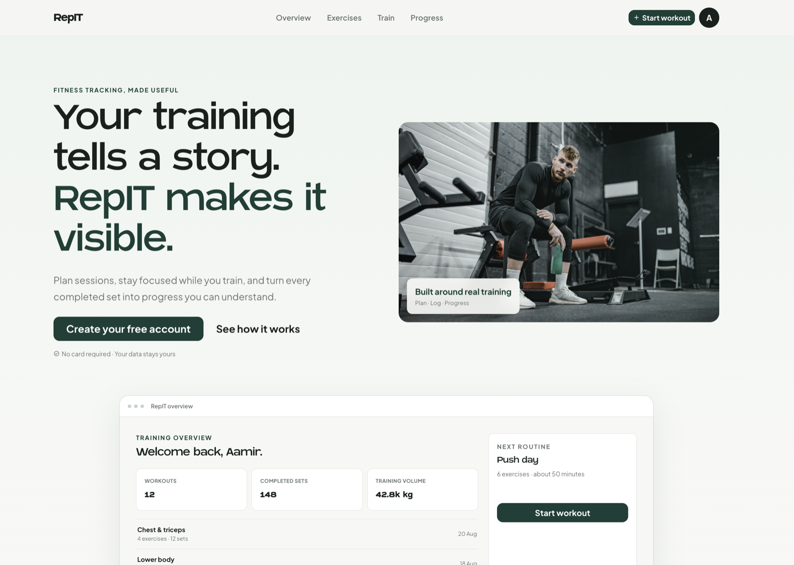
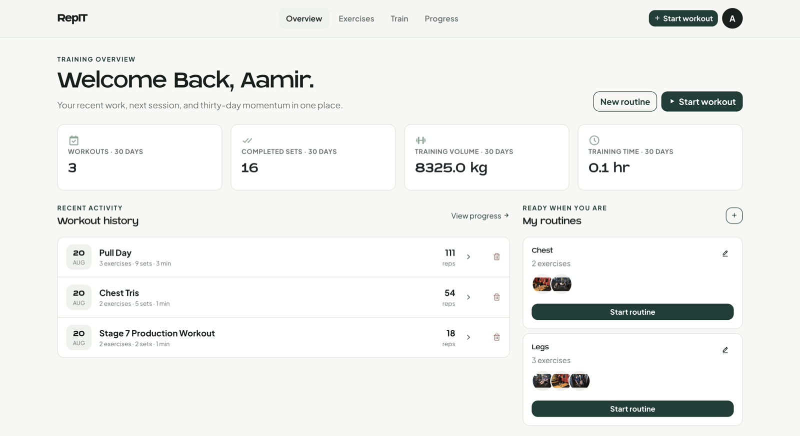
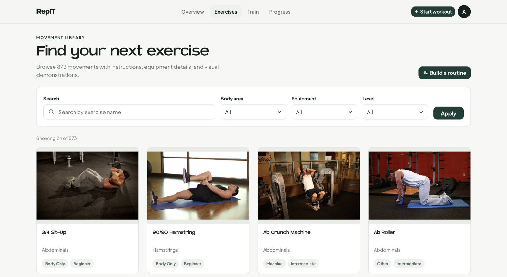
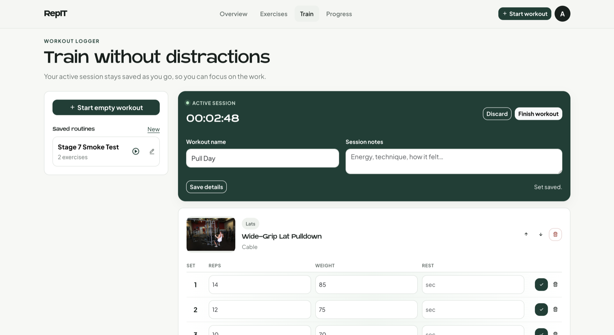
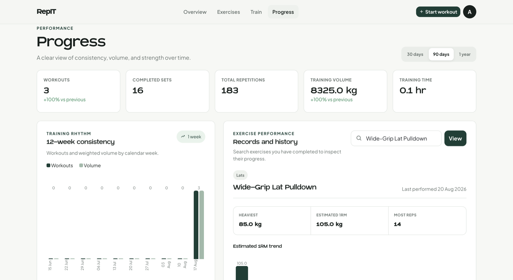
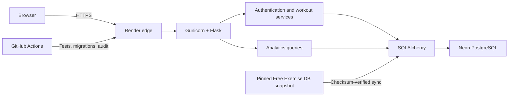

# RepIT

**A production-deployed strength training platform for planning routines, recording resilient workout sessions, and turning completed sets into useful progress analytics.**

[Live demo](https://repit-inq2.onrender.com/) · [Deployment guide](docs/DEPLOYMENT.md) · [Security](docs/SECURITY.md)

> RepIT runs on Render's free tier, so the first request after inactivity can take about a minute while the service wakes.

## Product tour



| Training dashboard | Exercise library |
| --- | --- |
|  |  |

| Live workout tracking | Progress analytics |
| --- | --- |
|  |  |

## What RepIT does

RepIT connects the full strength-training workflow instead of treating routines, workout logs, and progress as separate tools:

- Browse and filter 873 exercises with instructions and two-frame demonstrations.
- Create, view, edit, and reuse personal workout routines.
- Start custom or routine-based sessions with one recoverable active workout per user.
- Record sets, repetitions, load, rest time, exercise order, workout names, and notes.
- Resume interrupted sessions and keep completed workouts immutable.
- Review workout history, training frequency, volume, streaks, personal records, and estimated 1RM trends.
- Track body measurements and switch between metric and imperial presentation.
- Delete workouts or permanently remove an account and its associated data.

## Why the implementation is interesting

RepIT began as a university Flask project and was rebuilt into a deployable product with explicit data-integrity and provider boundaries.

- **Provider-independent history:** completed sessions snapshot exercise names and metadata, so catalogue changes cannot rewrite past workouts.
- **Transaction-safe workout state:** database constraints and service-layer ownership checks prevent duplicate active workouts, invalid set values, and edits to completed sessions.
- **Reproducible catalogue:** Free Exercise DB is vendored at an exact upstream commit and checksum-verified; deploys never depend on a paid API or an unpinned network response.
- **Defensible analytics:** calculations include completed sets only, retain canonical metric storage, and document how volume and Epley estimated 1RM are derived.
- **Fail-closed production settings:** deployment refuses weak secrets, non-PostgreSQL production databases, invalid proxy trust, or unsafe configuration ranges.
- **Operational readiness:** health checks, structured request logging, dependency auditing, migration checks, recovery guidance, and concurrency-safe deployment preparation are included.

## Architecture



### Technology

| Area | Implementation |
| --- | --- |
| Application | Python 3.12, Flask, Jinja, Bootstrap 5 |
| Persistence | SQLAlchemy, Alembic/Flask-Migrate, PostgreSQL in production, SQLite in development |
| Authentication | Flask-Login, Werkzeug password hashing, Flask-WTF CSRF protection |
| Production | Gunicorn, Render Blueprint, Neon pooled PostgreSQL |
| Verification | `unittest`, GitHub Actions, `pip-audit`, migration and compilation checks |
| Observability | JSON logs, request IDs, liveness/readiness endpoints, optional Sentry |

## Data model

The relational model separates reusable plans from historical training:

- A `User` owns routines, workout sessions, and measurements.
- A `Workout` is a reusable routine linked to catalogue exercises.
- A `WorkoutSession` is a specific active or completed training event.
- A `SessionExercise` stores ordering plus an exercise snapshot for durable history.
- An `ExerciseSet` records repetitions, load, rest time, and completion state.
- `Height` and `Weight` measurements are user-scoped and unique per date.

## Exercise catalogue

RepIT uses [Free Exercise DB](https://github.com/yuhonas/free-exercise-db), released under The Unlicense/public-domain dedication. The repository contains a checksum-verified snapshot pinned to an exact upstream commit: 873 exercises with instructions, difficulty, category, equipment, muscle metadata, and two demonstration images.

The synchronisation operation is idempotent: it creates and updates catalogue rows, deactivates removed records, and preserves any exercise already referenced by user history. RepIT has no exercise API key, paid catalogue dependency, or runtime catalogue quota.

See [snapshot provenance](data/free-exercise-db/SNAPSHOT.md) and [third-party notices](THIRD_PARTY_NOTICES.md).

## Local development

Requires Python 3.12 or newer.

```bash
git clone https://github.com/aamirk24/RepIT.git
cd RepIT
python3 -m venv .venv
source .venv/bin/activate
python -m pip install -r requirements.txt
python -m flask --app main db upgrade
python -m flask --app main seed-exercises
python -m flask --app main run
```

Open `http://127.0.0.1:5000/signup` and create a local account.

Copy `.env.example` to `.env` to customise development configuration. Local environment files and SQLite databases are ignored; never commit real credentials.

## Tests and quality gates

```bash
python -m unittest discover -s tests -v
python -m compileall -q app migrations tests
APP_ENV=testing python -m flask --app main db upgrade
python -m pip_audit -r requirements.txt
```

CI runs the test suite, compiles the application, applies the complete migration chain, verifies a single migration head, and audits production dependencies before Render deploys the commit.

## Production design

The deployed application uses Render and a pooled Neon PostgreSQL connection. Startup obtains a PostgreSQL advisory lock, applies pending migrations, synchronises the pinned catalogue, and then starts Gunicorn. This prevents concurrent instances from racing through deployment preparation.

- `GET /health` verifies the application process.
- `GET /health/ready` also verifies database access and controls production routing.
- Dynamic responses use `no-store`; static assets receive bounded caching.
- Production cookies are Secure, HTTP-only, and SameSite.
- Responses include CSP, HSTS, frame, MIME, permissions, referrer, and request-ID headers.
- Application logs exclude request bodies, query strings, cookies, passwords, and client IP addresses.

See the [deployment](docs/DEPLOYMENT.md), [operations](docs/OPERATIONS.md), and [backup and recovery](docs/BACKUP_AND_RECOVERY.md) runbooks.

## Analytics definitions

Analytics include completed workouts and completed sets only. Weighted volume is `external load × repetitions`; bodyweight sets contribute to set and repetition totals but not weighted volume because RepIT does not invent a bodyweight load. Estimated one-repetition maximum uses the Epley formula for weighted sets of 1–12 repetitions.

Weights and measurements are stored canonically in kilograms and centimetres, then converted for imperial display. Exercise history is grouped by RepIT's internal exercise identity and uses the snapshot captured when the workout was performed.

## Current limitations

- Render's free service sleeps after inactivity and does not provide an always-on availability commitment.
- Email verification and password recovery are deferred until a transactional email provider and verified sending domain are available.
- The catalogue is updated through reviewed repository snapshots, not unreviewed runtime network calls.
- Exercise images currently use commit-pinned upstream URLs rather than owned object storage.
- RepIT is a personal, non-commercial portfolio project, not medical or professional training advice.

## Privacy and responsible use

The live application provides a [Privacy Policy](https://repit-inq2.onrender.com/privacy), [Terms of Use](https://repit-inq2.onrender.com/terms), and [Fitness Disclaimer](https://repit-inq2.onrender.com/fitness-disclaimer). Security reports should follow [docs/SECURITY.md](docs/SECURITY.md).

## Licence

The exercise catalogue retains its upstream public-domain dedication. No separate licence is currently granted for the RepIT application source code.
